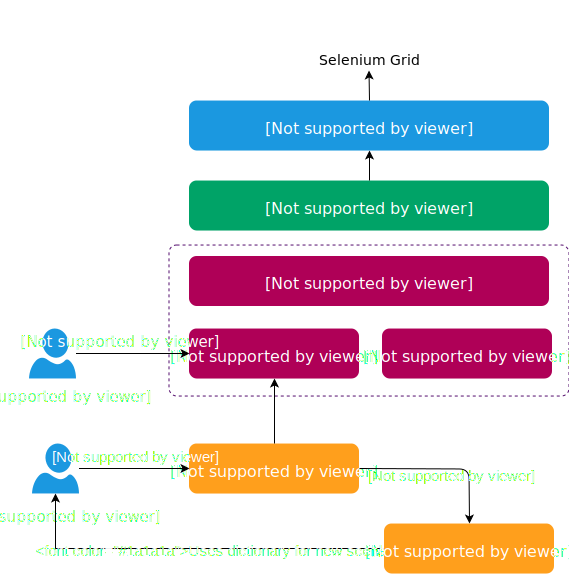

# bdd-typescript
BDD + TypeScript + Selenium example of automation

# Frameworks

* TypeScript
* Cucumber.js
* Selenium-webdriver
* Protractor

## Features and Scenarios structure

features/
    feature area/
        story.feature

steps/
    feature area/
        steps.step.ts

views/
    view area/
        view.view.ts

## References

* Cucumber - https://docs.cucumber.io/
* Protractor - https://www.protractortest.org/#/

